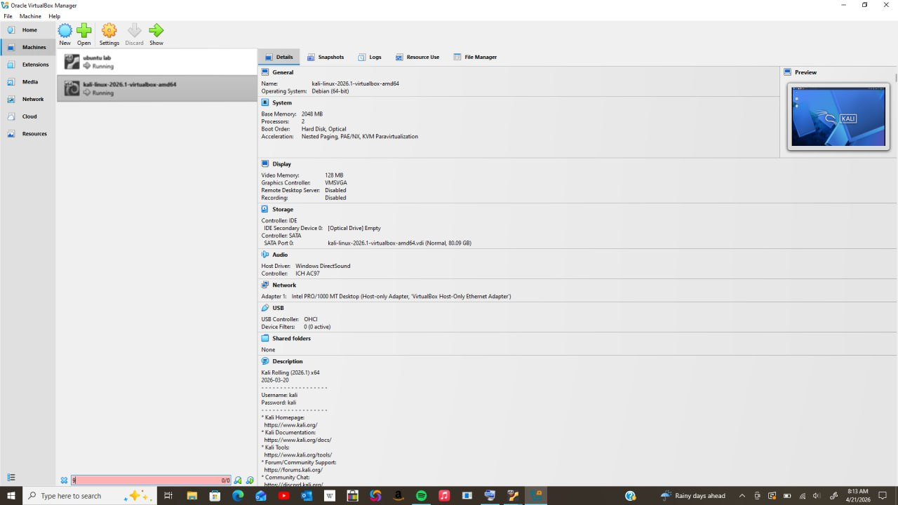
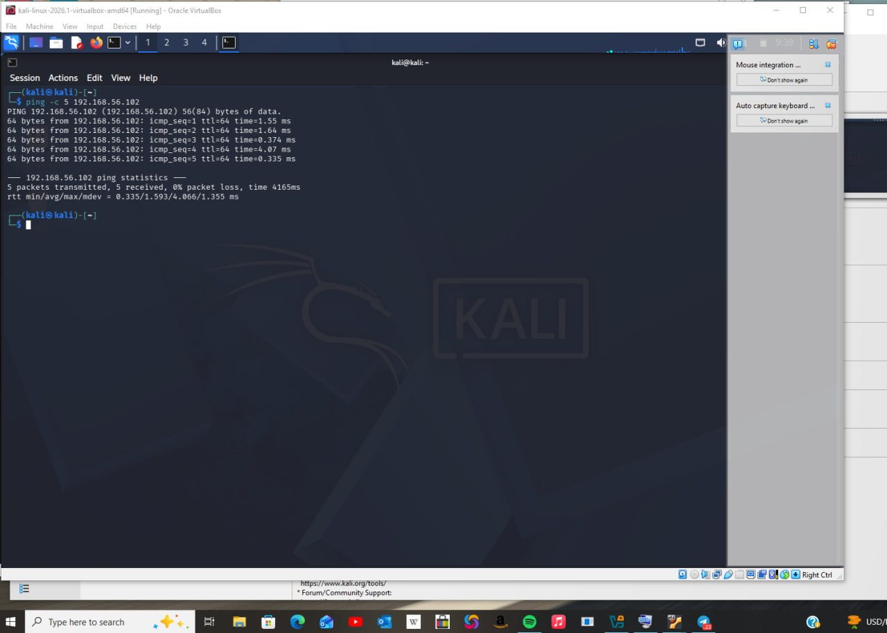
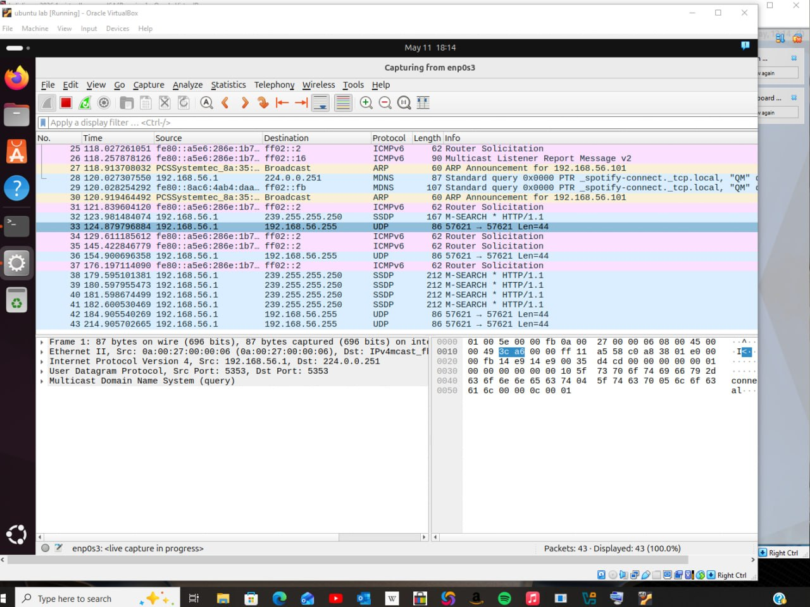
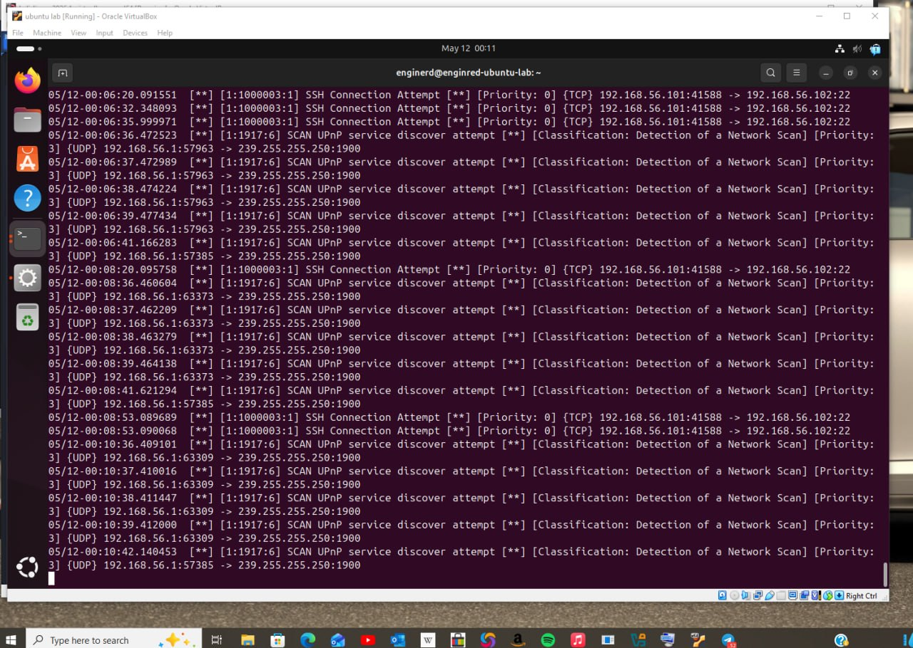

# 🛡️ Home SOC Lab — Network Security Monitoring


## 📌 Project Overview
Built a home Security Operations Center (SOC) lab using 
VirtualBox, Kali Linux and Ubuntu to simulate and detect 
real network attacks as a Blue Team analyst.

## 🛠️ Tools Used
| Tool | Purpose |
|------|---------|
| VirtualBox | Virtualization platform |
| Kali Linux | Attacker machine |
| Ubuntu | Defender/Monitor machine |
| Nmap | Network scanning & reconnaissance |
| Wireshark | Packet capture & traffic analysis |
| Snort IDS | Intrusion detection & alerting |

## 🌐 Lab Architecture

```
[Kali Linux 192.168.56.101] ---attacks---> [Ubuntu 192.168.56.102]
        Attacker                                 Defender
```

## 📋 Phases

### Phase 1 — Lab Setup
- Installed VirtualBox on Windows host
- Configured Kali Linux and Ubuntu VMs
- Set both VMs to Host-Only network adapter
- Verified connectivity via ping test
- Confirmed IPs: Kali (192.168.56.101) Ubuntu (192.168.56.102)

### Phase 2 — Network Discovery
- Ran Nmap service scan: `nmap -sV 192.168.56.102`
- Ran aggressive scan: `nmap -A 192.168.56.102`
- Ran ping sweep: `nmap -sn 192.168.56.0/24`
- Ran SYN scan: `sudo nmap -sS 192.168.56.102`
- Captured all traffic with Wireshark
- Saved packet capture as .pcap file

### Phase 3 — Intrusion Detection with Snort
- Installed Snort IDS on Ubuntu
- Configured HOME_NET to 192.168.56.0/24
- Wrote 3 custom detection rules
- Successfully detected all simulated attacks

## 🔍 Nmap Findings
| Port | State | Service | Version |
|------|-------|---------|---------|
| 22/tcp | open | SSH | OpenSSH 9.6p1 Ubuntu |
| 80/tcp | open | HTTP | Apache httpd 2.4.58 |

## 🚨 Snort Custom Rules

```
alert icmp any any -> any any (msg:"ICMP Ping Detected"; sid:1000001; rev:1;)
alert tcp any any -> $HOME_NET any (msg:"Port Scan Detected"; flags:S; sid:1000002; rev:1;)
alert tcp any any -> $HOME_NET 22 (msg:"SSH Connection Attempt"; sid:1000003; rev:1;)
```

## 🚨 Attacks Detected
| Attack | Rule Triggered | Result |
|--------|---------------|--------|
| ICMP Ping sweep | sid:1000001 | ✅ Detected |
| Port scan | sid:1000002 | ✅ Detected |
| SSH attempt | sid:1000003 | ✅ Detected |
| Network scan | Snort built-in | ✅ Detected |

## 🛡️ Security Recommendations
1. Disable SSH password authentication — use key-based only
2. Keep Apache updated to patch vulnerabilities
3. Block OS fingerprinting using firewall rules
4. Monitor SSH logs regularly for brute force attempts
5. Implement fail2ban to auto-block repeated SSH failures

## 🎯 What I Learned
- How attackers perform network reconnaissance
- How to capture and analyze network traffic
- How to write custom IDS detection rules
- How Blue Team analysts monitor for threats
- Real SOC analyst tools and workflows

## 📸 Screenshots

### Phase 1 — Lab Setup



### Phase 2 — Network Discovery



### Phase 3 — Snort IDS

